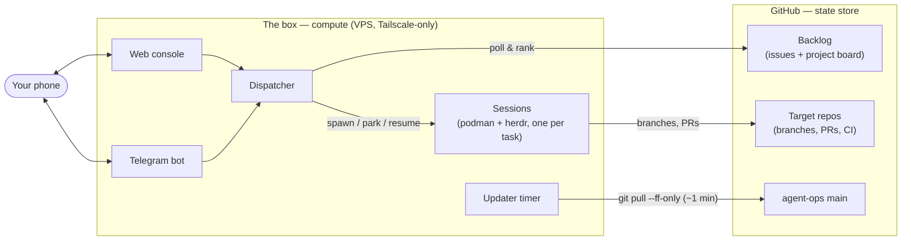
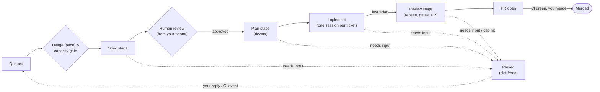

# agent-ops

**Your backlog gets worked while you sleep. You review from your phone.**

agent-ops turns a small dedicated VPS into an autonomous engineering box: a
dispatcher drains your GitHub-hosted backlog by running sandboxed Claude Code
sessions around the clock, spending your subscription's tokens *deliberately*
instead of letting them expire, and reporting back over Telegram and a mobile
web console. Your PC stays off.

## Why

If you develop with Claude Code on a subscription plan, you have two standing
inefficiencies:

- **Your nights are idle.** The agent only works while you're at the keyboard,
  so 12+ hours a day of potential throughput is simply lost.
- **Your token windows go to waste.** Usage you don't spend before the window
  resets is gone. Unused capacity at the end of a window is a sunk cost.

agent-ops closes both gaps:

- **Asynchronous overnight work.** File tasks into the backlog during the day;
  the box specs, plans, and implements them through the night, each stage in a
  fresh sandboxed session, ending in a CI-gated PR waiting for your morning
  review.
- **Pace-aware spawning.** Before every spawn the dispatcher reads each
  provider's usage windows — the 5-hour session, the week, and any
  per-model week such as Fable's — and admits a model only while every
  window it draws on has headroom. The session window keeps its ceiling
  (relaxed when the reset is close). The weekly windows follow a spending
  schedule that counts weekend hours at half weight, so the box holds back
  on Saturday and Sunday and spends the saved share Monday to Friday. A
  provider whose usage can't be read fails safe and spawns nothing. Which model runs is a **track**: triage picks one for the spec stage, the spec session picks one for the rest, and each track lists models per stage in order of preference, so the box takes the first one with headroom and keeps it for the whole stage.
- **24-hour access from your phone, PC off.** The box is reachable over
  Tailscale only. The web console and Telegram bot are always on — you can
  check progress, answer an agent's question, or approve a spec from anywhere.
- **A board that answers "what needs me?" at a glance.** The board is two
  zones. **Needs you** comes first — Needs review, PR review, Parked, Failed,
  Stalled on budget — and everything in the pipeline zone (Queued, In
  progress, Awaiting CI, Resuming, Done, Wont do) is the box's problem.
  Queued shows the ranked, not-yet-claimed issues as ghost cards behind the
  claimed ones. Empty columns collapse into a strip of zero-count chips, so
  "no failures" is visible rather than missing. On a phone the board shows
  one column at a time through tabs. Capacity and a usage panel sit above
  the board so you always know how hard the box is working: every provider's
  windows with their headroom, and one gate saying whether the box would
  spawn its default model right now.

## How it works

The guiding rule: **GitHub is the state store; the box is the compute.** There
is no CI→VPS RPC. The deployment repository selects the application revision
and configuration that the box pulls.





- **Dispatcher** (`dispatcher/`) — polls the backlog, ranks it, selects the
  next task within usage headroom and capacity limits, provisions a git worktree, and
  launches a Claude Code session for it. Capacity is box-wide: work already in
  flight runs first, then each free unit goes to the target with the fewest
  active tasks.
- **Staged pipeline** — each task moves through **spec → plan → implement (one fresh session per ticket) → review**,
  each stage a fresh session whose only input is the previous stage's committed
  artifact. Specs pause at a human review gate before implementation spends
  real tokens on them.
- **Bounded loops** — review fixes, gate failures, end-to-end fixes and CI
  fixes on an open PR each have a configured cap; hitting it parks the task
  with the finished tickets intact and pings you, it never fails the task.
- **Sessions** run in rootless Podman containers (the `agent-ops-session`
  image: Node + Claude Code CLI, git, gh, Python/pipenv, pnpm), one per task,
  each in a tab of the box's [herdr](https://herdr.dev) server — the agent-aware multiplexer that gives the dispatcher the agent's real lifecycle (`working` / `idle` / `blocked`) instead of screen-activity heuristics, plus TTY persistence and reply injection. Sessions are
  disposable; state lives in artifacts and the persistent claude-home.
- **Park / resume** — when a session needs human input or is waiting on a CI
  run, the dispatcher stops the container, frees the slot, and resumes via
  `claude --continue <message>` when the wake event fires (a reply from you or
  CI completion). Woken tasks jump to the head of the queue — a paused agent
  never blocks a slot, and your answer never waits in line.
- **Deployment separation** — application code lives here; the operator's
  infrastructure repository owns systemd units, provisioning, session images,
  credentials integration, and the selected application revision.

### Daily backlog triage

An `agent-ops-triage.timer` fires at 07:30 Europe/Madrid and enqueues a triage
request; the dispatcher runs it in a real capacity slot (skipping the day if no
slot frees within 2 h). Per repo, a **read-only** Claude session reads the
issues touched since that repo's cursor and records decisions to a file;
deterministic Python (`dispatcher/triage_apply.py`) is the only GitHub write
path, applying labels and author questions. Closes are never executed — only
suggested in the single Telegram report that closes the sweep.

**Prerequisite — once per triaged repo, before its first sweep.** Triage
records `auto` (routine enough to automate) or `human-required` (needs heavy
human interaction) on the issues it judges, and a label that does not exist in
the repo's inventory is rejected rather than created — the sweep never mutates
label taxonomy. Create them up front, or the first sweep's report is a wall of
`unknown label(s) ['auto']` rejections and nothing gets labeled:

```bash
gh label create auto --repo OWNER/REPO \
  --description "Routine enough for an agent to take unattended" --force
gh label create human-required --repo OWNER/REPO \
  --description "Needs heavy human interaction; not agent-ready" --force
```

## Two ways to drive it from your phone

**Web console** (`web/` + `frontend/`) — the board view above, plus per-task
pages with the stage timeline, the spec awaiting your approval, a persistent Artifacts section, and a read-only console (pane tail plus scrollable history, snapshot-backed once the session ends). To interact with a session, attach from a terminal: `herdr --remote box` on the desktop (herdr installed locally, same version as the box, `box` an SSH alias over the tailnet), or [Moshi](https://getmoshi.app) on a phone. Operating rule: attach to watch; reply through Telegram or the board — the dispatcher may park a session while you are typing in it. Reply to
a parked agent, park, kill, retry, or resume a task, and manage the queue —
including model-capacity warnings on queued and claimed tasks, with one-shot
controls to run despite that usage limit or use another entry of the task's track —
all from the same UI. Failures and history get their own pages, so nothing
silently disappears.

The board renders saved task cards and capacity from `/api/board/snapshot`
while `/api/board` fetches live queue rankings (the ghost cards in Queued) and
the claim forecast. Cards may reorder when scores arrive; a loading or
unavailable message stays visible until live details are available. Secondary pages load when opened to keep the
initial board download small.

**Telegram** (`telegram/`) — outbound notifications and digests, plus inbound
replies that feed straight back into parked sessions. Queue control from the
same chat: `/queue` shows the ranked backlog; `/boost N [k]` / `/demote N [k]`
adjust an issue's priority band; `/next N` enqueues an issue at the head
(`/next N force` also makes it Ready + `auto`; blocked and in-progress issues
are never forceable).

## Layout

| Path            | What lives there                                              |
| --------------- | ------------------------------------------------------------ |
| `dispatcher/`   | Backlog polling, task selection, usage gate, sessions, state |
| `web/`          | FastAPI backend for the console (board, usage, terminal WS)  |
| `frontend/`     | React SPA — board, task pages, queue, failures, history      |
| `telegram/`     | Outbound notifications/digests and inbound reply handling    |
| `prompts/`      | Stage prompts (spec, plan, implement, review, address-review) and the triage prompt   |
| `tests/`        | pytest suite                                                 |
| `targets.example.yaml` | Template for the box-local `targets.yaml` (capacity, thresholds, model policy) |

## Development

Requires Python ≥ 3.11.

```bash
./scripts/setup.sh    # .venv, Python and frontend deps, agent skills
pytest
```

Start new work with `./scripts/new-worktree.sh <branch> [base]`. It creates `.worktrees/<branch>` from the latest `origin/<base>` (default `main`) and runs setup there, so a new worktree always has its skills. Setup also enables the committed git hooks (`core.hooksPath .githooks`). Their `post-checkout` hook installs the skills in any new worktree, including a plain `git worktree add` or one Claude Code creates.

### Agent skills

Two kinds of agent skills live in this repo:

- **Committed:** the [mattpocock/skills](https://github.com/mattpocock/skills) set in `.agents/skills/`, pinned by `skills-lock.json`.
- **Not committed:** the skills from [jesdi/general-skills](https://github.com/jesdi/general-skills) (backlog, crap-gate, implement-spec, review-diff, to-spec, to-tickets, …). Only their list, `.my-skills.json`, is committed. The skills are gitignored and installed into `.my-skills/`, with symlinks in `.claude/skills/`.

Global Claude Code config (rules, hooks, and plugins like engram, ponytail and codex, which lets Claude hand work to Codex) lives in the private [jesdi/claude-config](https://github.com/jesdi/claude-config). Run its `install.sh` once per machine.

`scripts/setup.sh` installs the project skills. To install only them (needs Node and pnpm), run `./scripts/install-skills.sh`.

To add a new one, run `pnpm dlx @jesdi/skills-cli install <skill> --agent claude` and add its `.claude/skills/<skill>` line to `.gitignore`.

## Deployment

Use `targets.example.yaml` as a schema example for your own configuration.
Run the dispatcher with `python -m dispatcher.main --config /path/to/targets.yaml`
and the console with `python -m web --config /path/to/targets.yaml`.

The maintained VPS deployment has moved to the private
[`jesdi/agent-ops-infra`](https://github.com/jesdi/agent-ops-infra) repository.
It owns the host configuration, bootstrap/updater, systemd units, session image,
Claude-home seed, and operational runbooks. Access requires repository permission.

Deployments may set `AGENT_OPS_COMMAND_WRAPPER` to an executable path that
prepares credentials and then executes its arguments. Without it, sessions call
Podman directly. Use `AGENT_OPS_SESSION_IMAGE` to select your session image.
Never put credentials in a targets file; supply them through your secret manager.

### GitHub permissions and PR polling

The repository PAT needs **Actions: read** to monitor GitHub Actions runs and
**Commit statuses: read** to monitor legacy CI status contexts, in addition to
the existing contents, issues, and pull-request permissions. Dispatching or
rerunning workflows still requires **Actions: write**.

PR lifecycle polling reads merge status and review feedback independently of CI.
CI failures cannot prevent a merged task from moving to Done. For an open PR,
the dispatcher reads Actions runs for its current head SHA and branch, keeping
the latest run/attempt per workflow and event; it also reads the latest commit
status per context. Superseded failures never trigger a repair round.
Unreadable CI sources produce warnings in the dispatcher log; the remaining
sources and PR lifecycle polling continue. Missing CI data is not a green verdict.

Fine-grained PATs cannot call the Checks API. The dispatcher therefore avoids
`statusCheckRollup` and `gh pr checks`. Third-party integrations that publish
only CheckRuns (neither Actions runs nor commit statuses) are not monitored by
this PAT-compatible path. Such integrations require a different authentication
method, such as a GitHub App, to monitor their checks. See GitHub's
[PAT limitations](https://docs.github.com/en/authentication/keeping-your-account-and-data-secure/managing-your-personal-access-tokens#fine-grained-personal-access-tokens-limitations)
and [Actions API permissions](https://docs.github.com/en/rest/actions/workflow-runs#list-workflow-runs-for-a-repository).

## License

[MIT](LICENSE) © 2026 jesdi

### Task artifacts

The task page keeps review artifacts accessible across sessions on desktop and
mobile. Open the spec on GitHub beside **Approve spec**, or use **Artifacts**
to revisit prototypes, diagrams, questionnaires, answers and other review files.
Links open the latest published content in a new tab. If GitHub publication
fails, local review and approval remain available.

Sessions register files automatically using the policy in
[prompts/artifacts.md](prompts/artifacts.md). HTML previews are self-contained;
Markdown is committed and pushed to the task branch. On merge, GitHub links
switch to the last verified commit so deleting the branch does not break them.

Stored box copies expire 30 days after done, failed or canceled, on the next
dispatcher pass. Paused tasks never start that countdown; reopening cancels it.
GitHub files and artifact metadata remain, including on archived task pages.
Existing failed-task worktrees are still preserved for autopsy.
