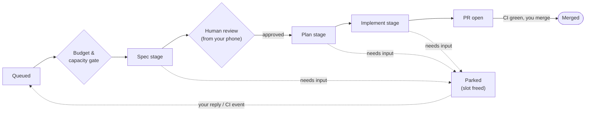

# agent-ops

**Your backlog gets worked while you sleep. You review from your phone.**

agent-ops turns a small dedicated VPS into an autonomous engineering box: a
dispatcher drains your GitHub-hosted backlog by running sandboxed Claude Code
sessions around the clock, spending your subscription's tokens *deliberately*
instead of letting them expire, and reporting back over Telegram and a mobile
web console. Your PC stays off.

## Why

If you develop with Claude Code on a subscription plan, you have two standing
inefficiencies:

- **Your nights are idle.** The agent only works while you're at the keyboard,
  so 12+ hours a day of potential throughput is simply lost.
- **Your token windows go to waste.** Usage you don't spend before the window
  resets is gone. Unused capacity at the end of a window is a sunk cost.

agent-ops closes both gaps:

- **Asynchronous overnight work.** File tasks into the backlog during the day;
  the box specs, plans, and implements them through the night, each stage in a
  fresh sandboxed session, ending in a CI-gated PR waiting for your morning
  review.
- **Budget-aware spawning.** Before every session spawn, the dispatcher checks
  live usage of the 5-hour window and holds back above a configurable ceiling —
  but when the window is about to reset, it *relaxes* the ceiling
  (reset-racing) so the remaining capacity gets used instead of expiring. If
  usage can't be determined, it fails safe and doesn't spawn.
- **24-hour access from your phone, PC off.** The box is reachable over
  Tailscale only. The web console and Telegram bot are always on — you can
  check progress, answer an agent's question, or approve a spec from anywhere.
- **A board that answers "what needs me?" at a glance.** Tasks flow across
  columns — Queued, In progress, **Needs review**, PR open, **Parked**,
  Awaiting CI, Resuming, Stalled on budget, Failed. The two bold ones are
  yours: everything else is the box's problem. Capacity and a live budget
  gauge sit above the board so you always know how hard the box is working.

## How it works

The guiding rule: **GitHub is the state store; the box is the compute.** There
is no CI→VPS RPC. The box converges to `main` by pulling; merging (CI-gated)
*is* the deploy.




- **Dispatcher** (`dispatcher/`) — polls the backlog, ranks it, selects the
  next task within budget and capacity limits, provisions a git worktree, and
  launches a Claude Code session for it.
- **Staged pipeline** — each task moves through **spec → plan → implement**,
  each stage a fresh session whose only input is the previous stage's committed
  artifact. Specs pause at a human review gate before implementation spends
  real tokens on them.
- **Sessions** run in rootless Podman containers (the `agent-ops-session`
  image: Node + Claude Code CLI, git, gh, Python/pipenv, pnpm), one per task,
  each wrapped in tmux for TTY persistence and reply injection. Sessions are
  disposable; state lives in artifacts and the persistent claude-home.
- **Park / resume** — when a session needs human input or is waiting on a CI
  run, the dispatcher stops the container, frees the slot, and resumes via
  `claude --continue <message>` when the wake event fires (a reply from you or
  CI completion). Woken tasks jump to the head of the queue — a paused agent
  never blocks a slot, and your answer never waits in line.
- **Pull-based convergence** — an `agent-ops-update.timer` on the box does
  `git pull --ff-only` against `main` (~every minute), reinstalls the package
  when deps change, syncs systemd units, restarts changed services, and
  rebuilds the session image when the `Containerfile` changes. Operating the
  box *is* merging PRs.

### Daily backlog triage

An `agent-ops-triage.timer` fires at 07:30 Europe/Madrid and enqueues a triage
request; the dispatcher runs it in a real capacity slot (skipping the day if no
slot frees within 2 h). Per repo, a **read-only** Claude session reads the
issues touched since that repo's cursor and records decisions to a file;
deterministic Python (`dispatcher/triage_apply.py`) is the only GitHub write
path, applying labels and author questions. Closes are never executed — only
suggested in the single Telegram report that closes the sweep.

**Prerequisite — once per triaged repo, before its first sweep.** Triage
records `auto` (routine enough to automate) or `human-required` (needs heavy
human interaction) on the issues it judges, and a label that does not exist in
the repo's inventory is rejected rather than created — the sweep never mutates
label taxonomy. Create them up front, or the first sweep's report is a wall of
`unknown label(s) ['auto']` rejections and nothing gets labeled:

```bash
gh label create auto --repo OWNER/REPO \
  --description "Routine enough for an agent to take unattended" --force
gh label create human-required --repo OWNER/REPO \
  --description "Needs heavy human interaction; not agent-ready" --force
```

## Two ways to drive it from your phone

**Web console** (`web/` + `frontend/`) — the board view above, plus per-task
pages with the stage timeline, the spec awaiting your approval, and a live
read-only terminal streaming the session's tmux pane over WebSocket. Reply to
a parked agent, park, kill, retry, or resume a task, and manage the queue —
all from the same UI. Failures and history get their own pages, so nothing
silently disappears.

**Telegram** (`telegram/`) — outbound notifications and digests, plus inbound
replies that feed straight back into parked sessions. Queue control from the
same chat: `/queue` shows the ranked backlog; `/boost N [k]` / `/demote N [k]`
adjust an issue's priority band; `/next N` enqueues an issue at the head
(`/next N force` also makes it Ready + `auto`; blocked and in-progress issues
are never forceable).

## Layout

| Path            | What lives there                                              |
| --------------- | ------------------------------------------------------------ |
| `dispatcher/`   | Backlog polling, task selection, budget, sessions, state     |
| `web/`          | FastAPI backend for the console (board, budget, terminal WS) |
| `frontend/`     | React SPA — board, task pages, queue, failures, history      |
| `telegram/`     | Outbound notifications/digests and inbound reply handling    |
| `provision/`    | `bootstrap.sh`, systemd units, and the pull-based updater    |
| `prompts/`      | Stage prompts (spec, plan, implement) and the triage prompt   |
| `docs/adr/`     | Architecture decision records                                |
| `tests/`        | pytest suite                                                 |
| `Containerfile` | The per-session sandbox image                                |
| `targets.example.yaml` | Template for the box-local `targets.yaml` (capacity, thresholds, model policy) |

## Development

Requires Python ≥ 3.11.

```bash
pip install -e '.[dev]'
pytest
```

## Deployment

agent-ops runs on a dedicated Hetzner VPS (2 vCPU / 4 GB, Ubuntu 24.04) with
Tailscale-only ingress (UFW deny-all on the public interface) — the console is
reachable from your devices and nothing else. All runtime units are systemd
**user** units under the `agent` user; convergence never runs as root.
Provisioning and rollout are documented in
[`provision/README.md`](provision/README.md), and the architecture decisions
in [`docs/adr/`](docs/adr/).

## License

[MIT](LICENSE) © 2026 jesdi
