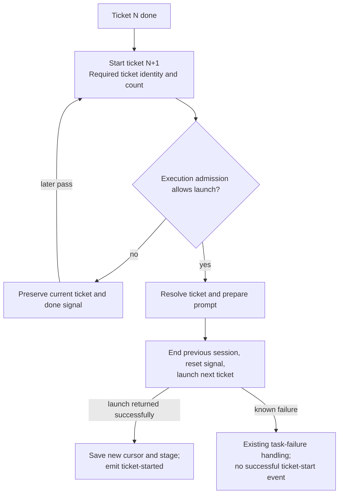

# Strict TDD plan: start a ticket as one admitted transition

Date: 2026-09-08  
Source: finding 3, **Needless sequencing / non-atomic update**, in [deep-quality-review.md](deep-quality-review.md).  
Stack base: `refactor/operator-request`, [PR #110](https://github.com/jesdi/agent-ops/pull/110).  
Base inspected and tested: `f80b7e68e7f9fbc844c5742f8fcdd3873b799d90`.

## Problem Statement

The machine emits `SetTickets(next, count)` followed by `SpawnStage(IMPLEMENT, ticket=next)`. The executor immediately saves the cursor and records `ticket-started`, then checks execution admission only when it reaches the spawn action.

When the budget denies launch, the old session's done signal survives alongside the advanced cursor. A later pass reads that same completion against the new cursor and skips work. For ticket 1 of 2, recovery goes straight to REVIEW even though ticket 2 never ran.

The defect still exists on PR #110's current head. Fixing the two earlier findings does not remove it.

## Solution

Represent starting a ticket as one operation that carries its required ticket number and set size. The dispatcher admits or defers that operation before making any ticket-start mutation. The operation owns resolving the ticket, preparing its prompt, resetting the signal, launching the fresh session, recording the cursor/stage, and reporting that the ticket started.

Budget denial leaves the current ticket, completion signal, loop counters, operator request, and queued messages untouched by this transition. A later pass derives the same next ticket and tries again. No extra persisted pending state is needed merely to wait for budget: the current task plus its completion signal already describe the pending work.



## Stack instructions

The intended implementation stack is:

```text
feat/agentic-orchestration
  └─ refactor/loop-policy-tdd
      └─ refactor/operator-request       PR #110
          └─ refactor/ticket-transition  proposed implementation branch
```

Create the implementation branch from the latest remote `refactor/operator-request` when implementation begins. Its PR targets `refactor/operator-request`, not `main` or `feat/agentic-orchestration`. The diff should contain only this ticket-transition change. If the parent PR is merged or updated first, resolve the actual new base before proceeding; do not blindly include the whole stack again.

Keep the other session's operator-request worktree untouched. Bring only this plan and its initial regression test into the new branch; do not copy the earlier plans' obsolete red tests over the implemented parent tests.

This deliverable is a local plan and initial red test. A stacked implementation PR is the next session's deliverable unless publication of the red-only plan is separately requested.

## Decision Document

- **One ticket-start action.** Replace the independent cursor-update action plus ticket-bearing generic spawn with a dedicated operation whose required data is ticket number and set size. Use it both after plan completion and between implement tickets. Other stage launches keep their existing behavior.
- **Admission precedes ticket-start mutations.** Denial does not advance the cursor, reset counters, clear a request, reset the stage signal, end the current session, mark messages delivered, or announce a start. Existing pass-wide usage notifications/heartbeat are unaffected.
- **Cursor has one meaning.** It identifies the implement ticket whose launch was accepted, never a ticket merely proposed while admission was denied. Keep the current persisted cursor/count fields and numbering; no migration is required.
- **Resolve before destructive lifecycle effects.** Check that the requested ticket exists and prepare the prompt before ending the previous session or changing its signal. Reuse the canonical ticket-file ordering; do not infer a new ticket from mutable incidental state in several callers.
- **One owner for the transition.** The execution operation handles signal reset, fresh launch, state commit and ticket-start event. Reuse existing launch mechanics internally without retaining an externally ordered `SetTickets` prerequisite. Deleting that public ordering requirement is part of completion.
- **Commit successful start once.** After the launcher returns successfully, save the new stage/cursor/count together and emit ticket-started once. Include the existing ticket information in stage-start reporting. A known validation/launch failure follows current task-failure behavior and must not claim the next ticket started.
- **Preserve loop-policy ownership.** A successfully started logical ticket uses the first refactor's stage-start reset. An admission denial does not reset counters; CI remains governed by its existing lifecycle. Do not duplicate field resets or cap comparisons in ticket handling.
- **Preserve request ownership.** Keep the parent refactor's current operator request while launch is deferred. Clear it through the existing successful stage-start lifecycle, retaining the canonical spec reference and pending operator messages.
- **Future execution selection remains separate.** This operation consumes the existing admission decision. A future suitable-model/weekly-allowance selector can deny or permit it without changing ticket progression. Do not add provider names, usage APIs or model-switch abstractions now.
- **Define atomicity precisely.** The fix removes partial ticket advancement on an admission denial and groups successful start state updates. A session process, a signal file and task JSON cannot form one database transaction. Do not claim exactly-once launch after arbitrary process termination or ambiguous remote timeouts. Preserve existing crash handling; a durable launch-recovery protocol is separate work if required.

## Strict TDD execution

Stop at red for this planning session. Production implementation is deferred. Do not mark the regression xfail/skip, change its expectation to REVIEW, or add a stub solely to obtain green.

During implementation, use one behavior at a time: write its test at the dispatcher-pass seam, run it and inspect the failure, implement the minimum real change, then run relevant existing tests. Only then start the next behavior. If an additional characterization already passes, keep it as a safety check and do not invent a failure. Do not bulk-author all future cases.

### Initial red slice: budget recovery cannot skip ticket 2

The initial test is [tests/test_ticket_transition.py](tests/test_ticket_transition.py). It uses the existing test harness with real task/signal files and the public `run_pass` entry point. Only usage fetching and external session/GitHub dependencies use the existing test substitutes. Assertions observe the stage and ticket prompt delivered to the session launcher, not private action-list structure.

Scenario:

1. Ticket 1 of 2 has signaled done.
2. Run one or three dispatcher passes with usage above the admission ceiling.
3. Verify no session was launched during denial.
4. Restore sufficient allowance and run another pass.
5. Expect exactly one IMPLEMENT launch, with ticket 2's path in its prompt.

Both parameter cases were run against an isolated archive of PR #110's head, with only this new test added. Neither the current checkout's older production code nor the other session's worktree was used as the test target.

```sh
cd /private/tmp/agent-ops-ticket-red-zpbe2tw5
/Users/jesdi/Projects/agent-ops/.venv/bin/python -m pytest -q tests/test_ticket_transition.py --tb=short
```

Observed red:

```text
one-denial:       expected (42, 'implement'), received (42, 'review')
repeated-denials: expected (42, 'implement'), received (42, 'review')
2 failed in 2.52s
```

These are behavior assertion failures, with successful collection and fixture setup. The temporary archive is disposable; in the implementation branch the command is simply the same pytest invocation from the branch root.

### Subsequent red → green slices

These rows are specifications to implement sequentially, not tests to write now. Each distinct behavior is one cycle. Implementation commits normally contain a test with its passing implementation; the current local deliverable deliberately remains red.

| Order | Test first | Minimum green behavior |
| --- | --- | --- |
| 1 | The initial recovery test above | Admit before advancement and start the actual next ticket. Do not implement unrelated launch cases yet. |
| 2 | While admission is denied, the persisted cursor and done signal remain unchanged | Keep the proposed ticket in the operation until admitted. Observe saved state through its public read interface. |
| 3 | Denied passes emit no ticket-started event and do not end the session | Move successful-start reporting and lifecycle effects behind admission. |
| 4 | A successful launch records cursor/count/stage consistently and reports the ticket once | Consolidate the complete ticket-start operation; remove the standalone cursor mutation action as soon as both callers migrate. |
| 5 | Plan completion denied by budget later starts ticket 1 with the correct set size | Route initial ticket launch through the same operation. Preserve plan validation and its existing format retry. |
| 6 | A further pass with the new ticket's working signal neither respawns nor advances | Preserve signal-reset ordering relative to successful launch and later passes. |
| 7 | Completion of ticket 2 of 2 launches REVIEW, deferred safely if admission is denied | Preserve last-ticket progression using existing generic stage-launch behavior. |
| 8 | Missing requested ticket produces failure handling with no ticket-started event or next cursor committed | Validate required input before launch side effects. Never fall through to REVIEW. |
| 9 | The session launcher raises and the next ticket is not reported as started | Preserve existing task-failure behavior while preventing premature successful-start state/events. |
| 10 | A denied start retains the first refactor's counters; a successful start resets the stage-scoped counters and retains CI | Delegate logical-stage reset to the existing loop policy. |
| 11 | A denied start preserves the parent refactor's request and spec; successful start clears the request and carries the spec to the prompt | Reuse the parent request lifecycle without inferring intent from park flags. |
| 12 | Queued messages remain undelivered after denial/failure and are delivered once after successful launch | Keep message delivery tied to the accepted launch, using existing queue semantics. |

Use existing passing tests for no-denial ticket progression, blocked tickets, spec propagation and loop resets as safety checks. Add only the missing scenario for each slice. Do not test that a particular helper was called or a dataclass was deleted.

### Cleanup after green behavior

Remove `SetTickets` and its executor branch, along with the optional implement-ticket parameter on the generic spawn action if the dedicated ticket-start action replaces it. Keep shared launch mechanics internal and direct; do not add wrappers that leave callers responsible for cursor-before-spawn ordering.

Retain ticket-start and stage-start event meanings and update documentation to describe cursor ownership. Update the visual guide to mark the budget-denial defect fixed only after the initial regression passes. Review the stacked diff for duplicated reset/request logic and unnecessary persisted state.

## Testing Decisions

- **Primary seam:** `run_pass`, with controlled usage observations, temporary state and existing external dependency fakes. The first regression checks the actual prompt/stage sent to a session, so it survives changes to internal action representation.
- **State/effects observations:** use public state/message/event read interfaces for persisted cursor, counters, current request, queued messages and start events. Expected values come from the scenario, not recomputation of implementation.
- **No standalone internal-helper suite.** Existing machine tests may be updated for changed action contracts, but the skipping regression must remain at the dispatcher seam where admission and persistence interact.
- **Known-failure injection:** use the existing fake launch failure facility; do not mock the new transition owner or policy module.
- **Validation target:** run against the new branch based on PR #110, not this workspace's older feature-branch checkout. The first two refactors' implemented tests are inherited from that base.

Focused validation during implementation:

```sh
python -m pytest -q tests/test_ticket_transition.py tests/test_main.py tests/test_machine.py tests/test_state.py tests/test_loops.py
```

After all slices are green, run the full Python suite and the parent's operator-request integration tests. Run additional frontend/API checks only if the implementation changes those contracts. Repeat deep-quality review on the child PR diff.

Before opening the child PR, fetch and rebase onto the latest actual parent base, rerun affected checks, and confirm the PR diff contains only ticket-transition work. Its title/body should explain the denied-budget trigger and before/after behavior, with the red reproduction and final verification evidence.

## Acceptance Criteria

- Budget denial never changes ticket progress or announces a launch that did not occur.
- Budget recovery starts the unworked ticket after one or repeated denied passes.
- Both ticket 1 and subsequent tickets use the same admitted ticket-start operation.
- Successful start updates stage/cursor/count together and emits ticket-started once.
- A known validation/launch failure does not report or commit a successful next-ticket start.
- Signal reset, message delivery, loop reset and request clearing remain owned by the admitted transition and existing modules.
- No new provider/quota framework, persistent pending-ticket state or duplicated loop/request policy is introduced.
- The initial red regression and relevant inherited suites pass in the implementation PR.
- The child PR targets the operator-request branch while that parent PR remains open.

## Out of Scope

- Reimplementing loop policy or the operator-request contract.
- Automatic retries after arbitrary process death, cross-process transactions, and exactly-once session launch guarantees.
- Weekly subscription model selection, runtime migration, and capacity-policy redesign.
- General ticket renumbering/editing workflows or broad artifact-schema changes.
- Publishing a production implementation during this planning/red-test session.
